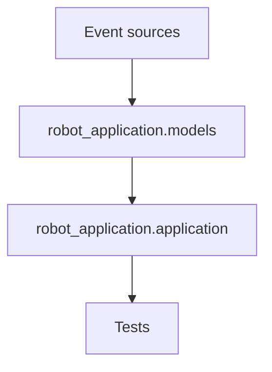

# Architecture

## Module Map

## Responsibilities

- `robot_application.models`
  - Defines the public data contracts: `Event` and `Effect`.
  - Keeps the value objects frozen and simple.

- `robot_application.application`
  - Owns all business state and transition logic.
  - Interprets events and returns only the newly created effects.
  - Tracks presence, greeting status, departure timing, and suppression state.
  - Exposes `snapshot()` as a defensive copy.

- `tests`
  - Verifies greeting, suppression, timeout, re-entry, and snapshot isolation behavior.

## State Ownership

- Person presence and session continuity are owned by `RobotApplication`.
- Conversation and meeting depth counters are owned by `RobotApplication`.
- Departure timing and de-duplication are owned by `RobotApplication`.
- No global mutable state is used.

## Extension Strategy

- VIP support
  - Add a policy layer or strategy object that can change greeting content or priority.
  - Keep VIP logic out of the core event loop.

- RAG support
  - Add a separate responder module that turns structured context into speech content.
  - The application should only decide *when* to speak, not *how* to generate answers.

- ROS 2 navigation
  - Introduce a bridge/adapter layer that converts `Effect` objects into ROS 2 commands.
  - Keep ROS 2 dependencies outside the core application state machine.

## Design Goal

The core class stays small and focused: one class owns one event-driven session state machine. New capabilities should be added through adapters, policies, or handlers rather than by growing a single monolithic class.
