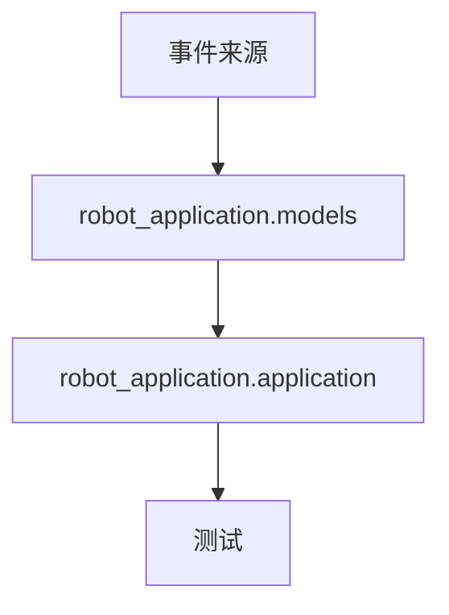

# 架构说明

## 模块关系图

## 职责划分

- `robot_application.models`
  - 定义对外的数据契约：`Event` 和 `Effect`
  - 保持数据对象冻结、简单、易测试

- `robot_application.application`
  - 拥有全部业务状态和状态迁移逻辑
  - 解释事件并只返回本次新产生的效果
  - 跟踪在场状态、迎宾状态、离场计时和抑制状态
  - 通过 `snapshot()` 提供防御性副本

- `tests`
  - 验证迎宾、抑制、超时、重新进入和 `snapshot()` 隔离等行为

## 状态归属

- 人员是否在场、会话是否连续，由 `RobotApplication` 负责
- 对话和会议的深度计数，由 `RobotApplication` 负责
- 离场计时和去重逻辑，由 `RobotApplication` 负责
- 不使用任何全局可变状态

## 扩展思路

- VIP 支持
  - 增加一层策略或规则对象，用来改变迎宾内容或优先级
  - 不把 VIP 逻辑塞进核心事件循环

- RAG 支持
  - 增加独立的回答模块，把结构化上下文转换成语音内容
  - 应用层只负责决定“什么时候说”，不负责“说什么内容由谁生成”

- ROS 2 导航
  - 增加桥接/适配层，把 `Effect` 转换成 ROS 2 指令
  - 把 ROS 2 依赖放在核心状态机之外

## 设计目标

核心类保持小而清晰：一个类只负责一个事件驱动的会话状态机。新增能力应该通过适配器、策略或独立处理器来扩展，而不是把所有东西堆进一个巨型类里。
